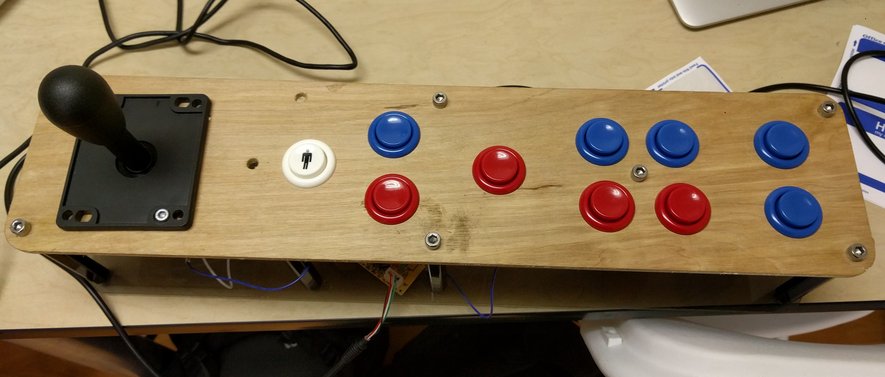

# the drivertsation 
 
the driver station is the interface between the robot and its operators

## driver station software

The driver station is the piece of software that communicates with the robot. The only supported OS for the driver station is Windows. The driver station is developed and maintained by National Instruments. The driver station allows for debugging robot code. Robots can connect to the driver station over wifi, ethernet, or usb.
 
## the physical driver station

The driver station can also refer to the collective parts used to run a robot. Minimally this will include a computer (usually a laptop). Driver stations generally also include a controller for a driver to move the robot around the field and another controller for another driver to manipulate the robot's mechanisms. For example, one driver of Kendrick LOWbar used an xbox controller to navigate around the field while the other driver used a custom button board to intake and shoot balls, lower the CDF, raise the portcullis, and stow the superstructure for low bar mode.

## dashboards

The driver station can utilize a dashboard. A few different dashboards are provided. SmartDashboard is fairly basic but functional. The Labview dashboard is highly customizable and can be used without using labview for robot programming. Dashboards are useful for debugging and visualizing information. Custom dashboards can be made to communicate with the robot using NetworkTables. 

### dashboard projects

* [SmartDashboard](https://github.com/wpilibsuite/SmartDashboard)
* [FRC Dashboard](https://frcdashboard.github.io/)
* [SFX dashboard](https://github.com/wpilibsuite/sfx)

## QDriverStation
 
QDriverStation is an unofficial driver station developed that works on windows/mac/linux. It works for the most part. [Learn more here](https://frc-utilities.github.io/) or [see the source here](https://github.com/FRC-Utilities/QDriverStation)
